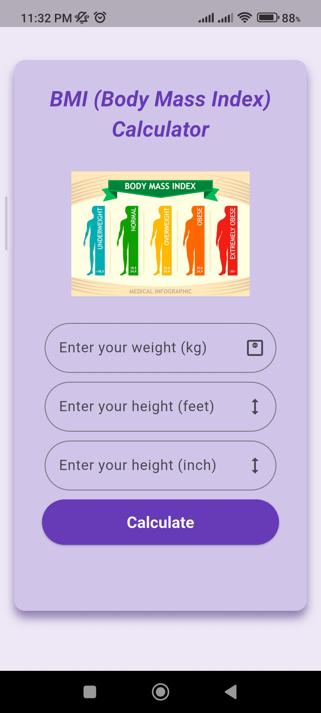
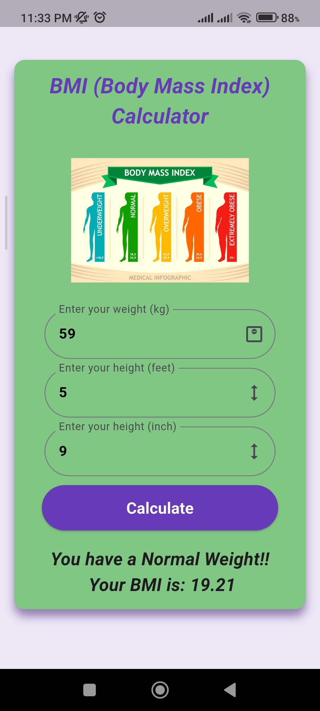
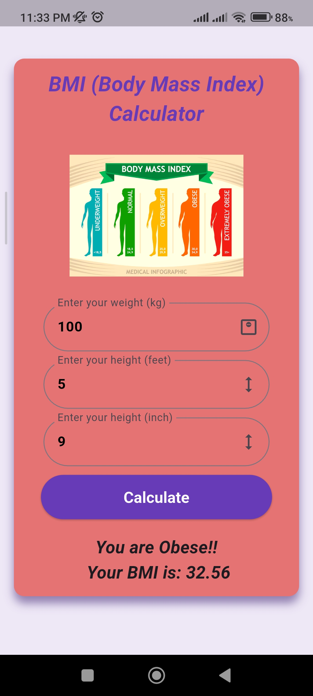

# 🧮 BMI Calculator App (Flutter)

A simple and clean Flutter application that calculates Body Mass Index (BMI) based on user input (height and weight). The app provides instant results with BMI category classification.

---

## 🚀 Features

- Input height and weight
- Instant BMI calculation
- BMI result classification:
  - Underweight
  - Normal
  - Overweight
  - Obese
- Clean and minimal UI
- Responsive design for different screen sizes

---

## 📸 Screenshots

<p float="left">
  
  
</p>

### Home Screen


### Normal-BMI Screen


### Obese-BMI Screen


---

## 🛠️ Tech Stack

- Flutter
- Dart
- Material Design

---

## 📱 How It Works

1. Enter your height (cm or meters)
2. Enter your weight (kg)
3. Tap "Calculate"
4. View your BMI result and category

---

## 📂 Project Structure


lib/
├── main.dart


---

## ⚙️ Installation & Run

Clone the repository:

```bash
git clone https://github.com/your-username/flutter-bmi-calculator.git

Navigate to project folder:
cd flutter-bmi-calculator

Install dependencies:
flutter pub get

Run the app:
flutter run
```
## 🎯 Future Improvements

Add unit selection (cm / ft)
Add history of BMI calculations
Improve UI animations
Add health tips based on BMI result

## 👨‍💻 Author

Umar
Flutter Developer | BSCS Student
